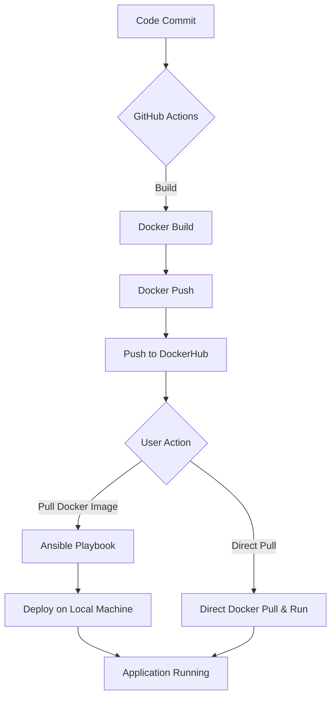

# LAMP Stack Pipeline 🛋️

This repo contains a pipeline that deploys a LAMP stack in the form of a Docker container named "lamp". The pipeline has the following flow:




To deploy the container run the Ansible playbook with:
```bash 
ansible-playbook playbook.yml
```
Or pull and run directly from Dockerhub at https://hub.docker.com/r/steveonlinux/lamp.

The playbook assumes SystemD is being used and that the package manager is either apt, DNF, or pacman. The site will be at http://localhost:8080. 
